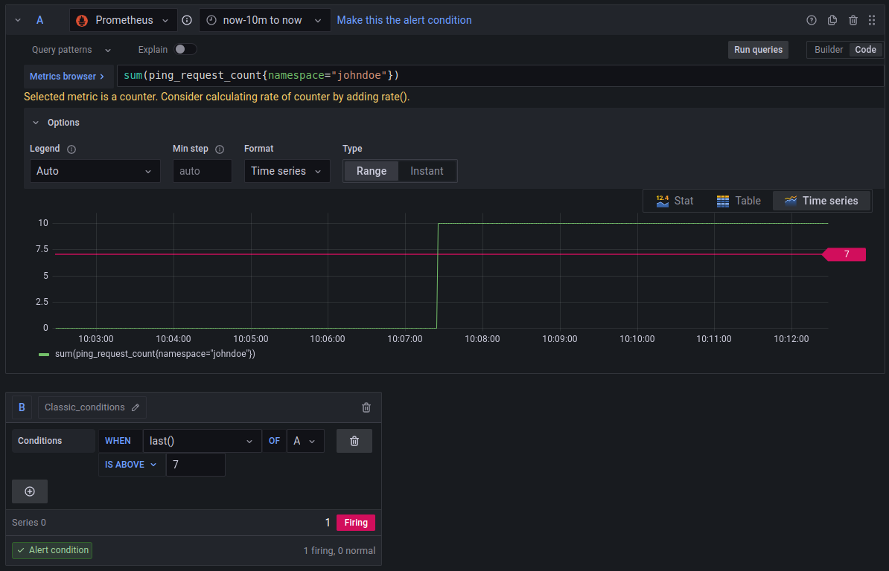

# Grafana

## Alerting

**This exercise is required by every participant.**

### Inspect the Grafana Web Interface

* Under Alerting / Alert Rules inspect the existing rules (filter by group and state)
* Search for `metrics-app.rules` which we defined as a PrometheusRule before

### Create a new alerting rule
 
* Create a new alert rule for your metrics app.
  * use this query: `sum(ping_request_count{namespace="<YOURNAME>"})`
  * adjust an alert condition according to your taste
  * play around with the alert trigger
* then save the rule

### Example Rule

### Trigger an alert for the rule

* Under Alerting / Alert Rules notice your newly created rule
* according to your threshold it might already be "firing"
* to trigger a firing alert you can call the `/ping` endpoint of your metrics-app
  until the limit is reached
  * `curl https://<YOURNAME>.workshop.metakube.org/ping`

### Silence the alert

* Create a short silence for the firing rule (choose `30s`)
* notice the automatic expiration of the silence
