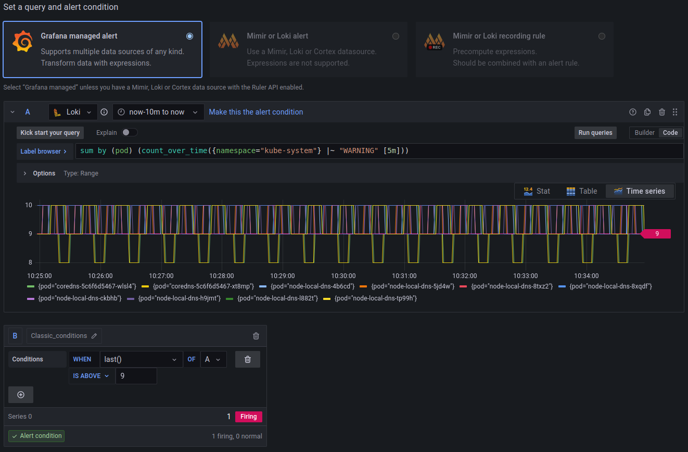

# Logging with Loki

**This installation is required only once per cluster.**

## Install Loki and configure Grafana

* [Official loki Helm Charts](https://artifacthub.io/packages/helm/grafana/loki)

* [Official promtail Helm Charts](https://artifacthub.io/packages/helm/grafana/promtail)

```shell
helm repo add grafana https://grafana.github.io/helm-charts
helm repo update
helm upgrade --install loki grafana/loki --namespace monitoring -f values-loki.yaml --version 4.5.1
helm upgrade --install promtail grafana/promtail --namespace monitoring -f values-promtail.yaml --version 6.8.2
kubectl apply -f datasource.yaml
```

## Datasources in Grafana

* In Grafana web interface view the new Loki datasource under Settings / Datasources

---

* Optional: if the datasource does not appear after a while you can restart Grafana

  ```shell
  kubectl rollout restart deployment -n monitoring prom-grafana
  ```

## Inspect Loki features in Grafana

### Loki Journal Log

* View the scrape config of one of the promtail pods

  ```shell
  kubectl -n monitoring exec -it promtail-<REPLACE-BY-ID> -- cat /etc/promtail/promtail.yaml
  ```

### Loki Alerting Rules

* In Grafana create an alerting rule from one of Loki's logs

* For example use this query:

  ```sql
  sum by (pod) (count_over_time({namespace="kube-system"} |~ "WARNING" [5m]))
  ```

**Example alerting rule**


