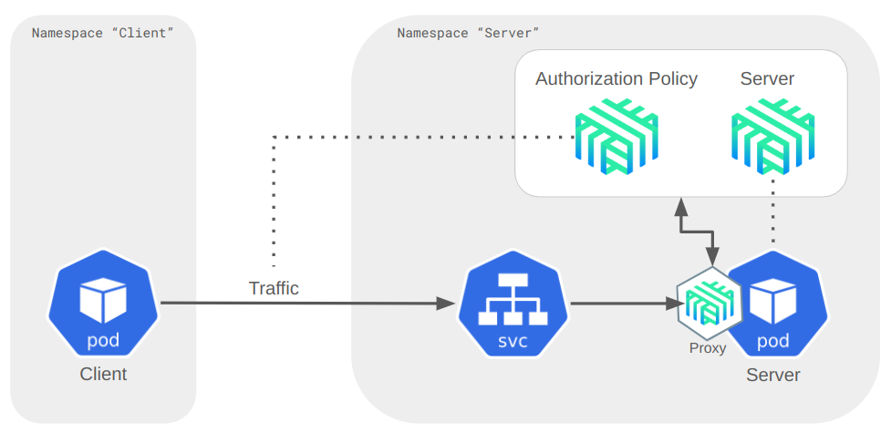

# LinkerD Service Mesh

## Using Authorization Policy

**This exercise can be performed by every participant.**

### Step 0 - Overview



### Step 1

* Prepare two individual namespaces

  ```shell
  read -p "Please enter your name (without blanks e.g. johndoe): " YOURNAME
  export YOURNAME
  kubectl create namespace ${YOURNAME}-server
  kubectl create namespace ${YOURNAME}-client
  ```

* Set annotations to have Linkerd inject a proxy

  ```shell
  kubectl annotate namespace ${YOURNAME}-server linkerd.io/inject=enabled -n ${YOURNAME}-server
  kubectl annotate namespace ${YOURNAME}-client linkerd.io/inject=enabled -n ${YOURNAME}-client
  ```

---

### Step 2

### Server namespace

* Deploy our demo web-application into server namespace and label it

  ```shell
  kubectl run web-application --image syseleven/metakube-hello:1.0.0 --port 8080 -n ${YOURNAME}-server
  kubectl label pod web-application app=web-application -n ${YOURNAME}-server
  ```

* Publish it through a service internally

  `kubectl expose pod web-application --port 8080 -n ${YOURNAME}-server`

* Verify it is working in the browser through a port-forward

  `kubectl port-forward web-application 8080:8080 -n ${YOURNAME}-server`

  * Visit http://localhost:8080

---

### Client namespace

Task: Create a client pod to send requests to the server.

* Create a serviceAccount which we will use for authentication.

  ```shell
  kubectl create serviceaccount client -n ${YOURNAME}-client
  ```

* Create the client pod and make it use the serviceaccount

  ```shell
  kubectl run client --image radial/busyboxplus:curl --overrides='{ "spec": {"serviceAccount": "client" } }' -n ${YOURNAME}-client --command -- sleep 3600
  ```

* Exec into client pod and send requests to server

  ```shell
  kubectl exec -it client -c client -n ${YOURNAME}-client -- curl web-application.${YOURNAME}-server:8080/from-client -v
  ```

* Verify in the Linkerd dashboard

**Result:**

Traffic from client to server should be allowed with `HTTP/1.1 200 OK`

---

### Step 3

### Secure the web-application in server namespace

Now we will secure the server application by applying an Authorization Policy in front of it
which will analyze incoming traffic.

* First, create a server CRD to identify our "server" providing the web-application:
 
  ```shell
  kubectl apply -n ${YOURNAME}-server -f server/server-crd.yaml
  ```

* Verify

  ```shell
  kubectl -n ${YOURNAME}-server get servers.policy.linkerd.io
  ```

* **Expected result:** From now on all requests should be denied.

* To verify, query the server again from the client pod:

* Exec into the client pod and send requests to the server

  ```shell
  kubectl exec -it client -c client -n ${YOURNAME}-client -- curl web-application.${YOURNAME}-server:8080/from-client -v
  ```
  
  ```shell
  > GET / HTTP/1.1
  > User-Agent: curl/7.35.0
  > Host: web-application.johndoe-server:8080
  > Accept: */*
  > 
  < HTTP/1.1 403 Forbidden
  < l5d-proxy-error: unauthorized request on route
  < date: Thu, 23 Mar 2023 11:45:42 GMT
  < content-length: 0
  < 
  ```

* Verify in the Linkerd dashboard under tap
* or directly from CLI while curl'ing (replace "YOURNAME" in the following command)

  ```shell
  linkerd viz tap pod/client --namespace <YOURNAME>-client --to pod/web-application --to-namespace <YOURNAME>-server
  ```

* **Result:** all requests are now forbidden.

---

### Step 4

### Apply an AuthorizationPolicy in server namespace


* First adjust your namespace in the file `server/authorization-policy.yaml`

  ```yaml
  [...]
  namespace: <YOURNAME>-client # <-- please adjust <YOURNAME>
  [...]
  ```

* Then apply the AuthorizationPolicy to control traffic

  ```shell
  kubectl apply -f server/authorization-policy.yaml -n ${YOURNAME}-server
  ```

* Verify

  ```shell
  kubectl -n ${YOURNAME}-server get authorizationpolicies.policy.linkerd.io
  ```

---

### Step 5

### Inspect incoming traffic from client

* Query the server again from the client pod:

* Exec into client pod and send requests to server

  ```shell
  kubectl exec -it client -c client -n ${YOURNAME}-client -- curl web-application.${YOURNAME}-server:8080/from-client -v
  ```

* Result - all requests should be allowed again.

---

### Step 6

### Now verify that our AuthorizationPolicy is enforced

**Task:** Start another client pod which does not use the correct serviceAccount

* Start a second client pod and curl the server web-application again

  ```shell
  kubectl run client2 --image radial/busyboxplus:curl -n ${YOURNAME}-client --command -- sleep 7200
  
  kubectl exec -it client2 -c client2 -n ${YOURNAME}-client -- curl web-application.${YOURNAME}-server:8080/from-client2 -v
  ```

* **Result:** Requests from client2 are be forbidden.

---

### Conclusion

We successfully applied an AuthorizationPolicy to our server web-application which controls incoming traffic by
certain criteria such as serviceaccounts.

Using a service mesh in Kubernetes lifts networking, security but also complexity to a higher level!
